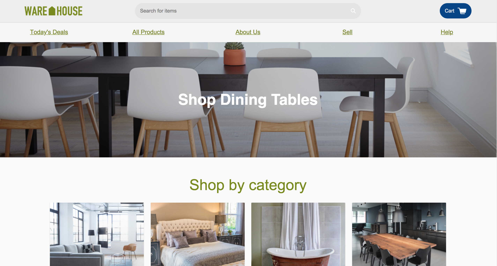
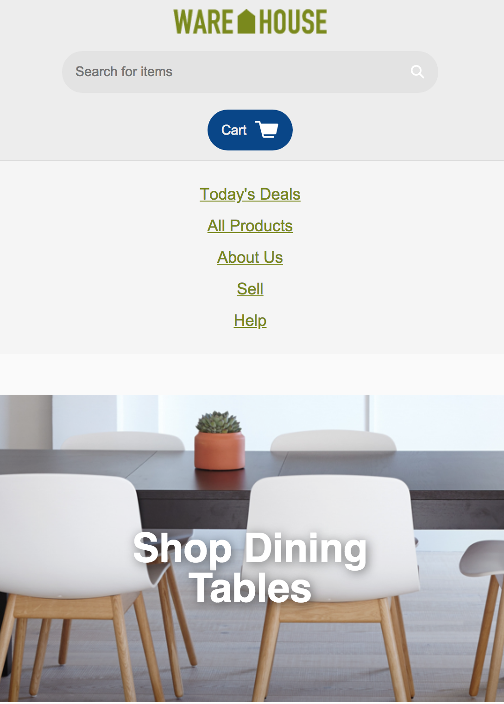
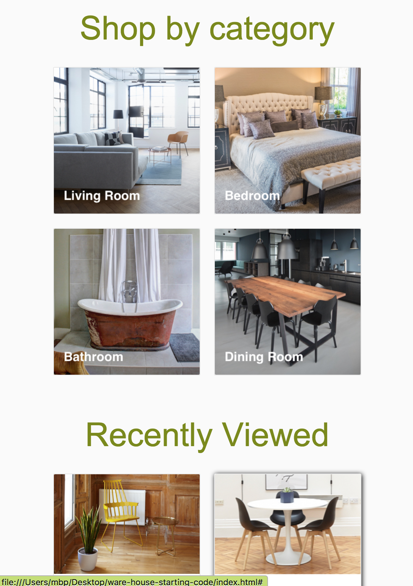

# Capstone: WareHouse Project
## Code Academy:  _Build Website UIs Course_
### by Steve Hanlon - March 20, 2018

##### Desktop

##### Mobile

#### Objectives:
**Step 1**: Get a clear understanding of the company’s goals, their data and what opportunities and challenges are present, your first task is to [create a design proposal](https://docs.google.com/document/d/14GkSXrGzrkhi4I4Qu54WTeGNxz8_hTVFxIqe8M2rF6s/edit).

**Step 2**: Share it with your Slack cohort group for feedback. Then adjust according to their feedback.

**Step 3**: Create a set of actionable tasks - user stories - that you plan on completing for the client.

**Step 4**: Download the starter code and begin editing the Warehouse website CSS.  Take in to account:
* Responsive Layout
* Accessibility attributes
* More memorable color scheme
* Separation of elements
